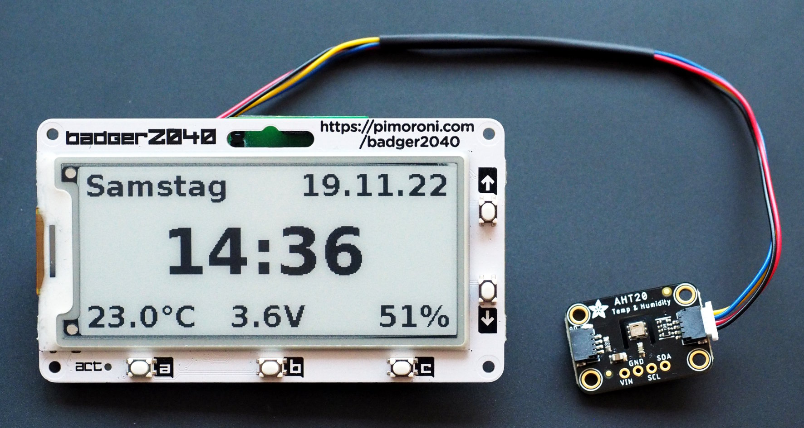

A Clock for E-Ink Displays
==========================

This project implements the software for an e-ink clock using CircuitPython.
The clock displays the current time and is updated every minute. It also
supports the display of temperature and humidity.

Update of date and time uses an attached ESP-01S (unless you use a board
with integrated WLAN like the Magtag or a PicoW). Update occurs at
system startup and once a day. An external RTC is used to keep date/time
in case this update fails.

The software is optimized to minimize battery usage. E.g. you can define
an "active" period during the day when updates take place, otherwise the
clock is left in deep-sleep.

**Note: this is work-in-progress.**

Hardware
--------

You need the following components:

  - a MCU with CircuitPython support
  - an e-ink display
  - an ESP-01S (optional)
  - an external RTC (optional)
  - a temperature/humidity sensor (optional)

Out of the box the software supports:

  - MCU+display: Badger2040 and Magtag
  - RTC: DS3231 and PCF8523
  - AHT20 (for temperature and humidity)

Porting to other hardware should be easy (see section "Hardware Hacking" below).

Wiring
------

Sensor and RTC use I2C. Connect to Stemma/Qt or respective pins. The ESP-01S
uses UART (RX, TX), a reset-GPIO, 3V3 and GND.

The Magtag only needs the RTC and the sensor. The Badger2040 has suitable
pads on the back for UART, 3V3 and GND. Use the INT-pad for the ESP-01S reset.

Installation
------------

  0. Install the current version of CircuitPython to your device

  1. Install the following libraries from the CircuitPython library-bundle to
     the `lib`-directory of your device  

       - adafruit_ahtx0
       - adafruit_bitmap_font
       - adafruit_bus_device
       - adafruit_display_shapes
       - adafruit_display_text
       - adafruit_ds3231
       - adafruit_espatcontrol
       - adafruit_pcf8523
       - adafruit_register
       - adafruit_requests

     The preferred way to do this is to use `circup` (note that the device
     must be mounted):  

         sudo apt-get -y install pip3
         sudo pip3 install circup
         circup --path /mountpoint/of/device install -r requirements.txt

  2. Clone the repository

  3. Configure the software for your board and preferences. See
     [Configuration](#configuration) below.

  4. Copy all files from below `src` to your device.

Configuration
-------------

For configuration, you need the python-file `configuration.py` in the
root-directory of your device. You can find a template in
`template/configuration.py'. Copy this file to your device and adapt it to
your needs.

There a few things you should change:

  - WLAN credentials

        secrets.ssid      = 'your_ssid'
        secrets.password  = 'your_password'
        secrets.retry     = 1
        secrets.debugflag = False
        #secrets.channel   = 6        # optional
        #secrets.timeout   = 10       # optional

  - timepoint of daily update of time via internet
    
        settings.TIMEAPI_URL      = "http://worldtimeapi.org/api/ip"
        settings.TIMEAPI_UPD_HOUR = 8
        settings.TIMEAPI_UPD_MIN  = 30

  - sensor calibration:
    
        settings.TEMP_OFFSET = 0
        settings.HUM_OFFSET  = 0

  - active time (saves battery during the night):    
    
        #settings.ACTIVE_END_TIME   = "-1:00"           # always active
        settings.ACTIVE_END_TIME    = "22:00"
        #settings.ACTIVE_START_TIME = "07:00"           # start at time-point
        settings.ACTIVE_START_TIME  = None              # start using a button

  - hardware setup for optional components:

        settings.rtc_ext = lambda: adafruit_pcf8523.PCF8523(i2c)
        #settings.rtc_ext = lambda: adafruit_ds3231.DS3231(i2c)
        settings.sensor = lambda: adafruit_ahtx0.AHTx0(i2c)
        settings.wifi_module = "wifi_impl_esp01"        # implementing module
        #settings.wifi_module = "wifi_impl_builtin"     # implementing module

Other settings (like `ui.*`) are optional and let you tweak the appearance
(especially useful on other hardware).

Hardware Hacking
----------------

To support alternative hardware, you have to implement a few lines of
python-code.

... (to be written)

